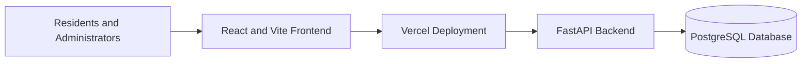

<div align="center">

# Socivio

<p>A full-stack apartment society maintenance platform for clearer requests, faster follow-up, and better resident communication.</p>

<p>
  <a href="https://society-maintenance-tracker-kappa.vercel.app/"><strong>Open the live application »</strong></a>
</p>

<p>
  
  
  
  
  
  
  
  
</p>

</div>

---

## Table of Contents

- [Overview](#overview)
- [Live Demo](#live-demo)
- [Features](#features)
- [User Roles](#user-roles)
- [Product Walkthrough](#product-walkthrough)
- [Screenshots](#screenshots)
- [Architecture](#architecture)
- [Tech Stack](#tech-stack)
- [Project Structure](#project-structure)
- [Local Development](#local-development)
- [Environment Variables](#environment-variables)
- [Testing](#testing)
- [Deployment](#deployment)
- [Security Notes](#security-notes)
- [Future Improvements](#future-improvements)
- [License](#license)
- [Author](#author)

---

## Overview

Socivio is a full-stack apartment society maintenance platform that gives residents one place to report issues, track progress, and read society announcements. Administrators can review requests, manage priorities and statuses, publish notices, and maintain a clearer view of day-to-day society operations.

Without a centralized system, residential societies often rely on disorganized messaging groups or manual logs that lead to missed tickets, lack of accountability, and delayed resolutions. Socivio provides structured ticket lifecycles, clear communication channels, and dynamic overdue tracking to keep property maintenance organized and transparent.

---

## Live Demo

[Open Socivio](https://society-maintenance-tracker-kappa.vercel.app/)

### Evaluator Flow

1. Open the live application.
2. Use the **Admin Demo** or **Resident Demo** button on the login page to fill the demo credentials.
3. Click **Sign In**.
4. Explore the role-specific dashboard.
5. Use the **Register** link to create a new Resident account if needed.

### Pre-Configured Demo Accounts

| Role | Email | Password | Landing View | Capabilities |
|---|---|---|---|---|
| **Administrator** | `admin.demo@society-tracker.com` | `DemoAdmin@2026` | `/admin/dashboard` | Manage complaints, transition statuses, adjust overdue threshold, broadcast notices |
| **Resident** | `resident.demo@society-tracker.com` | `DemoResident@2026` | `/dashboard` | Raise complaints with photo uploads, track personal tickets, view society notice board |

---

## Features

### Resident Features
- **Resident registration and login**: Self-service account creation for apartment residents.
- **Submit maintenance complaints**: Raise issues with title, category, description, and optional photo attachment.
- **Category selection**: Choose from Plumbing, Electrical, Carpentry, Cleanliness, Security, or Other.
- **Track complaint history**: View personal tickets with real-time status transitions (Open, In Progress, Resolved, Overdue).
- **Edit open tickets**: Update details of existing tickets while they remain in the Open state.
- **Society notices**: Access official community announcements and important alerts on the notice board.
- **Resident dashboard**: Quick-glance metrics for active, in-progress, and resolved complaints.
- **Responsive design**: Clean layout across mobile, tablet, and desktop screens.

### Administrator Features
- **Administrator login**: Protected access for property managers and committee members.
- **Admin dashboard**: Overview metrics, overdue breakdowns, and recent activity logs.
- **Date filter presets**: Dynamic statistics filtering across Last 7 Days, Last 30 Days, Last 90 Days, All Time, or custom date ranges.
- **Complaints management**: Full list of resident tickets with status, category, priority, and overdue filters.
- **Lifecycle transitions**: Move tickets between Open, In Progress, and Resolved with mandatory audit notes.
- **Priority assignment**: Set and adjust complaint priority (Low, Medium, High).
- **Notice management**: Create, edit, and delete announcements, with an Important pin toggle.
- **Dynamic SLA settings**: Configure society-wide overdue resolution thresholds (1 to 365 days).
- **Server-side authorization**: Strict backend role verification on all administrative routes.

---

## User Roles

| Role | Capabilities |
|---|---|
| **Resident** | Submit complaints, track personal requests, edit open tickets, view notices, use the resident dashboard |
| **Administrator** | Review all complaints, update status and priority, manage notices, adjust overdue settings, view admin analytics |

> **Security Note**: Public registration is resident-only. The backend assigns the Resident role during registration. Administrator access is enforced server-side and is not granted by a frontend role selector.

---

## Product Walkthrough

### Landing Page
The public landing page introduces Socivio, outlining key benefits for both residents and facility management teams, with direct navigation to login, registration, and product highlights.

### Resident Dashboard
Residents can view personalized summary cards showing open, in-progress, and resolved requests, view recent society announcements, and quickly navigate to the complaint creation form.

### Complaint Management
The complaints section allows residents to view their tickets and allows administrators to filter across all society tickets. Each ticket displays ticket ID, category, resident details, priority level, current status, and timestamps.

### Administrator Dashboard
The administrator console provides a high-level operational overview, including total requests, open tickets, in-progress tickets, resolved tickets, overdue metrics, and recent status history events.

### Notice Management
The notice board serves as the central communication channel for the complex. Administrators can broadcast general updates or pin critical announcements, while residents can review notices in chronological order.

### Authentication
Authentication uses JSON Web Tokens (JWT) stored client-side and verified server-side on every protected API call. Quick demo access buttons allow evaluators to inspect both resident and administrator experiences without manual data entry.

---

## Screenshots

Screenshots can be added here from the deployed application after capturing the final production views.

---

## Architecture



- **Frontend**: Single-page application built with React, Vite, and Tailwind CSS.
- **Backend**: Python ASGI application powered by FastAPI, exposing RESTful API endpoints under `/api`.
- **Database**: PostgreSQL hosted on Neon, managed via SQLAlchemy ORM and Alembic migrations.
- **File Storage**: Cloudinary for resident photo attachments.
- **Deployment**: Vercel monorepo configuration with static frontend hosting and Python serverless function execution.
- **Security**: Stateless JWT authentication with bcrypt password hashing and server-side role enforcement.

---

## Tech Stack

| Layer | Technology | Purpose |
|---|---|---|
| **Frontend** | React 18, Vite | Single-page application build and UI rendering |
| **Styling** | Tailwind CSS | Utility-first styling and responsive design |
| **Icons** | Lucide React | Clean icon system across all views |
| **Backend** | FastAPI, Python 3.11 | High-performance ASGI REST API framework |
| **Database** | PostgreSQL (Neon) | Relational persistence for users, tickets, notices, and settings |
| **ORM & Migrations** | SQLAlchemy 2.0, Alembic | Database models, query abstractions, and schema versioning |
| **Authentication** | JWT (python-jose), bcrypt | Stateless token-based auth and password hashing |
| **Photo Uploads** | Cloudinary | Cloud image storage for maintenance attachments |
| **Deployment** | Vercel | Monorepo hosting with static frontend and Python serverless functions |
| **Testing** | Vitest, pytest | Frontend component tests and backend API test suites |

---

## Project Structure

```text
society_maintenance_tracker/
├── api/
│   └── index.py              # Vercel serverless function entrypoint
├── backend/
│   ├── alembic/              # Alembic migration revisions
│   ├── alembic.ini           # Alembic migration configuration
│   ├── app/
│   │   ├── core/             # Configuration, database, security, and dependencies
│   │   ├── models/           # SQLAlchemy database models
│   │   ├── routers/          # FastAPI route controllers
│   │   ├── schemas/          # Pydantic v2 validation models
│   │   ├── scripts/          # Seeder script (seed.py)
│   │   └── main.py           # FastAPI application definition
│   ├── main.py               # Local backend entrypoint
│   ├── requirements.txt      # Backend Python dependencies
│   └── tests/                # Pytest unit and integration test suite
├── frontend/
│   ├── src/
│   │   ├── api/              # Axios API client modules
│   │   ├── components/       # Common, complaint, and notice UI components
│   │   ├── context/          # React AuthContext
│   │   ├── pages/            # Application views and dashboard pages
│   │   ├── test/             # Vitest test suite
│   │   ├── App.jsx           # Main application routing
│   │   └── main.jsx          # React DOM entrypoint
│   ├── index.html            # HTML template
│   ├── package.json          # Frontend dependencies and scripts
│   ├── tailwind.config.js    # Tailwind CSS configuration
│   └── vite.config.js        # Vite build and proxy configuration
├── scripts/
│   └── smoke_test.py         # Deployment verification script
├── .env.example              # Environment variables template
├── package.json              # Monorepo root scripts
├── requirements.txt          # Root Python dependencies for Vercel
├── schema.sql                # PostgreSQL schema reference
├── vercel.json               # Vercel build and routing configuration
└── README.md
```

---

## Local Development

### Prerequisites
- Python 3.11+
- Node.js 18+ and npm
- PostgreSQL database (local instance or Neon serverless connection)

### 1. Clone the Repository

```bash
git clone https://github.com/gokulsivas/society_maintenance_tracker.git
cd society_maintenance_tracker
```

### 2. Environment Configuration

Copy `.env.example` to `.env` in the project root:

```bash
cp .env.example .env
```

Configure your `DATABASE_URL` and `JWT_SECRET_KEY` inside `.env`.

### 3. Backend Setup

```bash
# Create and activate Python virtual environment
python -m venv backend/venv

# macOS or Linux
source backend/venv/bin/activate

# Windows PowerShell
.\backend\venv\Scripts\Activate.ps1

# Install backend dependencies
pip install -r backend/requirements.txt

# Run database migrations
alembic -c backend/alembic.ini upgrade head

# Seed initial evaluation accounts
python backend/app/scripts/seed.py

# Start FastAPI development server
uvicorn backend.app.main:app --reload --port 8000
```

### 4. Frontend Setup

In a separate terminal window:

```bash
cd frontend
npm install
npm run dev
```

Open [http://localhost:5173](http://localhost:5173) in your browser.

### 5. Production Build

To test the production frontend build locally:

```bash
cd frontend
npm run build
```

---

## Environment Variables

The table below describes the variables defined in `.env.example`:

| Variable | Purpose | Required |
|---|---|---|
| `DATABASE_URL` | PostgreSQL connection string with SSL mode | Yes |
| `ENVIRONMENT` | Runtime mode (`development` or `production`) | Yes |
| `JWT_SECRET_KEY` | Secret key used for signing JWT access tokens | Yes |
| `JWT_ALGORITHM` | Token signing algorithm (default: `HS256`) | Yes |
| `ACCESS_TOKEN_EXPIRE_MINUTES` | Token expiration duration in minutes | Yes |
| `CORS_ORIGINS` | Allowed frontend origins (comma-separated) | Yes |
| `CLOUDINARY_CLOUD_NAME` | Cloudinary cloud identifier for photo storage | Only if image uploads are enabled |
| `CLOUDINARY_API_KEY` | Cloudinary API key | Only if image uploads are enabled |
| `CLOUDINARY_API_SECRET` | Cloudinary API secret | Only if image uploads are enabled |
| `BREVO_API_KEY` | Brevo REST API key for email delivery | Only if email notifications are enabled |
| `EMAIL_FROM` | Sender email address for notifications | Only if email notifications are enabled |
| `EMAIL_FROM_NAME` | Sender display name | Only if email notifications are enabled |
| `FRONTEND_URL` | Deployed frontend URL for email links | Only if email notifications are enabled |
| `VITE_API_URL` | API base path prefix for frontend requests | Yes (default: `/api`) |

> **Note**: Transactional email notifications are optional and disabled unless a provider, API key, and verified sender are configured.

> **Security Note**: Never commit `.env` files, database URLs, JWT secrets, API keys, or production credentials to version control.

---

## Testing

### Frontend Tests (Vitest)
```bash
cd frontend
npm test
```

### Backend Tests (Pytest)
```bash
# Activate your virtual environment first
pytest backend/tests
```

### Test Coverage Areas
- Authentication and token lifecycle.
- Role-based access control and unauthorized route redirects.
- Resident complaint creation, editing, and listing flows.
- Administrator status transitions and audit history tracking.
- Notice publication, retrieval, and importance filters.
- Dynamic overdue threshold calculations.
- API validation and error response handling.

---

## Deployment

The application is configured for deployment on Vercel:

- **Frontend**: Built statically with `npm run build` and output to `frontend/dist`.
- **Backend API**: Served as serverless Python functions via `@vercel/python` using `api/index.py`.
- **Routing**: Configured via `vercel.json` to route `/api/*` to FastAPI and SPA paths to `/index.html`.

[Open the production application](https://society-maintenance-tracker-kappa.vercel.app/)

---

## Security Notes

- Public registration creates Resident accounts only.
- Administrator access is enforced server-side on every protected endpoint.
- Frontend route guards enhance user experience, while backend RBAC guarantees data isolation.
- Passwords are encrypted using bcrypt before database storage.
- Production secrets and database connection strings are managed through environment variables.
- Disposable demo accounts contain sample data for evaluation purposes.

---

## Future Improvements

- Automated email notifications for complaint status changes.
- Push notifications for high-priority society announcements.
- Advanced administrative reporting with exportable PDF and CSV summaries.
- Configurable notification preferences per resident.
- Enhanced resident profile management.

---

## License

A license has not yet been added.

---

## Author

Built by [Gokul Sivasubramaniam](https://github.com/gokulsivas)
